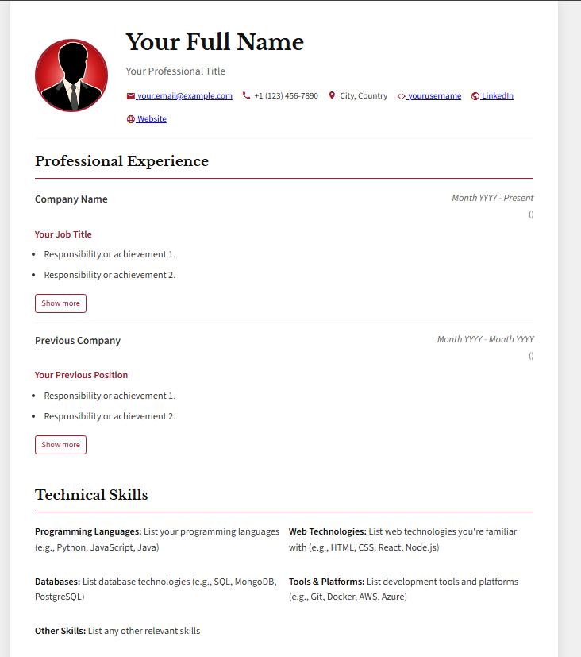
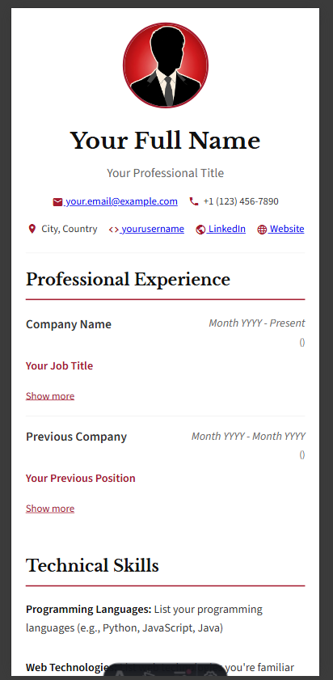

# 🎓 Professional CV/Portfolio Website

[](https://astro.build/)
[](https://www.typescriptlang.org/)
[](https://biomejs.dev/)
[](https://github.com/features/actions)
[](https://vercel.com/)
[](https://yaml.org/)

> ✨ **A modern, responsive CV/Portfolio website template built with Astro.js** ✨

Create a stunning professional portfolio with this elegant template inspired by **[Harvard design principles](https://careerservices.fas.harvard.edu/resources/bullet-point-resume-template/)**. Features automated deployment, AI-powered maintenance, and enterprise-grade code quality tools.

🌟 **[Live Demo](https://your-demo-link.vercel.app)** | 📚 **[Documentation](./AGENTS.md)** | 🚀 **[Get Started](#-quick-start)**

## 🚀 Quick Start

```bash
# 1. Use this template or clone the repository
git clone https://github.com/your-username/portfolio.git
cd portfolio

# 2. Install dependencies
npm install

# 3. Customize your CV data
# Edit src/data/cv.yaml with your information

# 4. Start development server
npm run dev
# Open http://localhost:4321

# 5. Build for production
npm run build
```

## 🎨 Preview

| Desktop View | Mobile View |
| :---: | :---: |
|  |  |

## 🚀 Project Structure

```text
/
├── public/
│   └── .nojekyll
├── src/
│   ├── components/       # Reusable Astro, React, Vue, etc. components
│   ├── data/             # Data files (e.g., cv.yaml for content)
│   ├── layouts/          # Layout components for pages
│   ├── pages/            # Astro pages, define routes
│   └── styles/           # Global styles or component-specific styles
├── .github/
│   └── workflows/
│       └── deploy.yml    # GitHub Actions for automated deployment
├── astro.config.mjs      # Astro configuration file
├── package.json          # Project dependencies and scripts
└── tsconfig.json         # TypeScript configuration
```

## 🧞 Commands

All commands are run from the root of the project, from a terminal:

| Command                   | Action                                           |
| :------------------------ | :----------------------------------------------- |
| `npm install`             | Installs dependencies                            |
| `npm run dev`             | Starts local development server at `localhost:4321` |
| `npm run build`           | Builds your production site to `./dist/`         |
| `npm run preview`         | Previews your build locally, before deploying    |
| `npm run format`          | Formats all files with Biome                   |
| `npm run lint`            | Lints all files with Biome                     |
| `npm run check`           | Formats and lints all files with Biome         |

## 🚀 Getting Started & Deployment

To use this template for your own portfolio, follow these steps. The recommended approach is to use GitHub's "template repository" feature to ensure your personal data remains private and the deployment process is smooth.

### Step 1: Create Your Private Repository

1. **Use this Template**: Click the **"Use this template"** button at the top of the repository page and select **"Create a new repository"**.
2. **Make it Private**: Choose a name for your repository and select the **Private** option. This is crucial to keep your CV data secure.
3. **Clone Your Repository**: Clone your new private repository to your local machine.

### Step 2: Add Your Content

1. **Install Dependencies**: Run `npm install` in the project's root directory.
2. **Customize `cv.yaml`**: Edit `src/data/cv.yaml` with your information.
3. **Add Profile Picture**: Place your profile picture (e.g., `profile.png`) in the `public/` directory and update the `profile_picture` path in your `cv.yaml`.

### Step 3: Update `.gitignore`

This is a critical step. To allow your `cv.yaml` and profile picture to be pushed to your private repository for deployment, you must:

1. Open the `.gitignore` file.
2. **Delete** the following lines:

    ```gitignore
    src/data/cv.yaml
    profile.png
    ```

3. Save the file. Now you can commit your personal data safely to your **private** repository.

### Step 4: Deploy Your Site

With your content and `.gitignore` updated, you can deploy your site. The recommended host is **Vercel** for its simplicity and seamless integration with GitHub.

#### Deploying with Vercel (Recommended)

1. Go to [vercel.com](https://vercel.com) and sign up with your GitHub account.
2. Click **"Add New..."** > **"Project"**.
3. Import your new private repository from GitHub.
4. Vercel will automatically detect that it's an Astro project and configure the correct build settings.
5. Click **"Deploy"**. Your site will be live in minutes.

## ✨ Key Features

### 🎨 **Design & UX**

- 📱 **Fully Responsive** - Looks perfect on desktop, tablet, and mobile
- 🎓 **Harvard-Inspired Design** - Professional, elegant, and timeless
- 🔤 **Google Fonts Integration** - Beautiful typography with Libre Baskerville
- 🎯 **Material Icons** - Consistent iconography throughout
- 🌙 **Print-Friendly** - Optimized for PDF generation

### ⚡ **Performance & Technology**

- 🚀 **Astro.js Powered** - Lightning-fast static site generation
- 📝 **TypeScript Support** - Type-safe development experience
- 🛠️ **Biome Integration** - Enterprise-grade linting and formatting
- 📦 **Zero Runtime JS** - Optimal performance by default
- 🔧 **Path Aliases** - Clean imports with `@/` prefix

### 📊 **Content Management**

- 📄 **YAML-Driven Content** - Easy to edit, version-controlled CV data
- 🔄 **Dynamic Sections** - Professional experience, education, skills, certifications
- 📈 **GitHub Integration** - Automatic project showcase
- ⏱️ **Smart Duration Calculation** - Automatic experience duration computation
- 🎯 **SEO Optimized** - Meta tags and structured data

### 🤖 **Automation & Maintenance**

- 🔄 **Dependabot Integration** - Automated dependency updates
- 🤖 **Jules AI Assistant** - AI-powered code maintenance
- ⚡ **GitHub Actions** - Automated deployment and CI/CD
- 🔍 **Code Quality Tools** - Biome linting with Astro-specific configurations

## 🚀 How to Use as a Template

This project is designed to be a reusable template for creating a personal CV/portfolio website. Follow these steps to get started:

### 1. Fork the Repository

Start by forking this repository to your own GitHub account.

### 2. Customize Your CV Data

All your personal information is stored in a single YAML file: `src/data/cv.yaml`. To get started, you just need to edit this file with your own professional experience, education, skills, and contact details.

### ⚠️ Security Warning

Be mindful of the personal information you share publicly. It is strongly recommended that you **do not** include sensitive data like your personal phone number or home address in `cv.yaml`.

## 🎨 Customization

To customize this portfolio for your own use:

1. **Content**: All content is managed in `src/data/cv.yaml`. Update this file with your personal information, experience, skills, and projects.
2. **Configuration**: Adjust the `site` and `base` values in `astro.config.mjs` to match your GitHub username and repository.
3. **Styling**: Modify the color scheme and other styles directly in the CSS variables within the `<style>` tag of the relevant components or pages.
4. **Profile Picture**: Replace `public/profile.jpeg` with your own profile picture. Ensure it's named `profile.jpeg` or update the path in `cv.yaml`.

## 🤖 Automation & Maintenance

This project includes automated workflows to help maintain code quality and dependencies:

### Dependabot

- **Automated Dependency Updates**: Dependabot is configured to check for outdated npm dependencies daily
- **Pull Requests**: When updates are available, Dependabot will automatically create pull requests with the necessary version bumps
- **Configuration**: Managed in `.github/dependabot.yml`

### 🛠️ Biome - Enterprise-Grade Code Quality

[Biome](https://biomejs.dev/) is a modern, fast, and comprehensive toolchain for web development that combines linting, formatting, and more in a single tool.

#### ⚡ **Why Biome?**

- **🚀 Performance**: 10-100x faster than ESLint + Prettier
- **🔧 Zero Configuration**: Works out of the box with sensible defaults
- **🎯 Comprehensive**: Linter, formatter, and import organizer in one tool
- **🛡️ Type-Safe**: Built with Rust for maximum reliability

#### 📋 **Available Scripts**

```bash
npm run format    # Auto-format all files
npm run lint      # Check for linting errors
npm run check     # Format + lint + auto-fix issues
```

#### ⚙️ **Astro-Specific Configuration**

This project includes optimized Biome configuration for Astro development:

```json
{
  "overrides": [
    {
      "includes": ["**/*.astro"],
      "linter": {
        "rules": {
          "correctness": {
            "noUnusedVariables": "off",
            "noUnusedImports": "off"
          }
        }
      }
    }
  ]
}
```

> **💡 Pro Tip**: The `noUnusedVariables` rule is disabled for `.astro` files because Biome's static analysis cannot track variable usage from Astro's script section to its template section. This is the recommended approach per Biome's documentation.

#### 🎯 **Key Benefits**

- ✅ **Zero Warnings**: Clean linting with 0 false positives
- ✅ **Consistent Formatting**: Automatic code formatting on save
- ✅ **TypeScript Integration**: Full TypeScript support with path aliases
- ✅ **CI/CD Ready**: Integrated with GitHub Actions for automated checks

### Jules - AI-Powered Code Maintenance

[Jules](https://jules.google/) is an AI assistant that can help with code refactoring and complex maintenance tasks.

#### How to Use Jules

1. **Create a GitHub Issue**:
   - Go to the **Issues** tab in your repository
   - Click **New Issue**
   - Add a clear title and description of the task
   - Add the `jules` label to the issue
   - Submit the issue

2. **Jules Will**:
   - Automatically detect the `jules` label
   - Create a new branch for the changes
   - Make the requested changes
   - Open a pull request with the proposed changes

3. **Review and Merge**:
   - Review the changes in the pull request
   - Run tests if applicable
   - Merge when satisfied

For more details on using Jules, see the [AGENTS.md](AGENTS.md) file.

### GitHub Actions

- **Automated Deployment**: The `.github/workflows/deploy.yml` workflow handles building and deploying your site to GitHub Pages.
- **CI/CD**: The workflow runs on every push to the `main` branch, ensuring your live site is always up to date.

## 🛠️ Tech Stack

| Category | Technology | Purpose |
|----------|------------|----------|
| **Framework** | [Astro.js](https://astro.build/) | Static site generation with zero JS by default |
| **Language** | [TypeScript](https://www.typescriptlang.org/) | Type-safe development experience |
| **Styling** | CSS3 + CSS Variables | Custom styling with Harvard-inspired design |
| **Icons** | [Material Icons](https://fonts.google.com/icons) | Consistent iconography |
| **Fonts** | [Google Fonts](https://fonts.google.com/) | Libre Baskerville for elegant typography |
| **Code Quality** | [Biome](https://biomejs.dev/) | Ultra-fast linting, formatting, and import organization |
| **Data Format** | [YAML](https://yaml.org/) | Human-readable CV content management |
| **Deployment** | [Vercel](https://vercel.com/) / [GitHub Pages](https://pages.github.com/) | Automated deployment with CI/CD |
| **Automation** | [GitHub Actions](https://github.com/features/actions) | CI/CD pipelines and automated workflows |
| **Dependencies** | [Dependabot](https://docs.github.com/en/code-security/dependabot) | Automated dependency updates |
| **AI Assistant** | [Jules](https://jules.google/) | AI-powered code maintenance and refactoring |

## 🤝 Contributing

Contributions are welcome! Here's how you can help:

1. **🐛 Report Bugs**: Open an issue with detailed information
2. **💡 Suggest Features**: Share your ideas for improvements
3. **🔧 Submit PRs**: Fork, create a feature branch, and submit a pull request
4. **📖 Improve Docs**: Help make the documentation better

### Development Workflow

```bash
# Fork and clone the repository
git clone https://github.com/your-username/portfolio.git
cd portfolio

# Install dependencies
npm install

# Create a feature branch
git checkout -b feature/your-feature-name

# Make your changes and test
npm run dev
npm run check  # Run linting and formatting

# Commit and push
git add .
git commit -m "feat: add your feature description"
git push origin feature/your-feature-name

# Open a Pull Request
```

## 📄 Documentation

For more detailed information about the automation setup and usage, please refer to:

- [AGENTS.md](AGENTS.md) - Complete guide to using Dependabot and Jules
- [GitHub Actions documentation](https://docs.github.com/en/actions)
- [Dependabot documentation](https://docs.github.com/en/code-security/dependabot)
- [Jules documentation](https://jules.google/docs/)
- [Biome documentation](https://biomejs.dev/)
- [Astro documentation](https://docs.astro.build/)

## ⭐ Show Your Support

If this project helped you create an amazing portfolio, please consider:

- ⭐ **Starring this repository**
- 🐦 **Sharing it on social media**
- 🤝 **Contributing to make it even better**

---

<div align="center">

**Built with ❤️ using Astro.js and modern web technologies**

[⬆️ Back to Top](#-professional-cvportfolio-website)

</div>
